# SheffieldR Git Workshop

This workshop will introduce some of the basic concepts for Git and hopefully help you develop a more reproducible and flexible workflow.

## Prerequisites

Before you start using git, there are a few components you need to install.

### R and RStudio

You should have a version of R installed on your platform of choice. The tutorial will use the built-in Git support with RStudio.

If you don't already have a version of RStudio installed, you can get a copy from [https://www.rstudio.com](https://www.rstudio.com).

### Git

Git comes as a separate package for the main platforms. You might already have Git installed. If you don't, you can get packages for:

 * Windows and Mac: [http://git-scm.com/downloads](http://git-scm.com/downloads)
 * Ubuntu Linux: `sudo apt-get install git-core`
 
## Setting up RStudio

Before creating a project, RStudio needs to be configured to use Git. Open the Settings page in RStudio and make sure *Enable version control interface for RStudio projects* is checked. Ensure the *Git executable* field is populated. If it isn't, it needs to be set to the directory containing git. For Windows, this will be in `C:\Program Files (x86)\Git\bin\git.exe` if you used the package from git-scm.com. On Linux or Macs it should be in `/usr/local/bin` or `/usr/bin`.

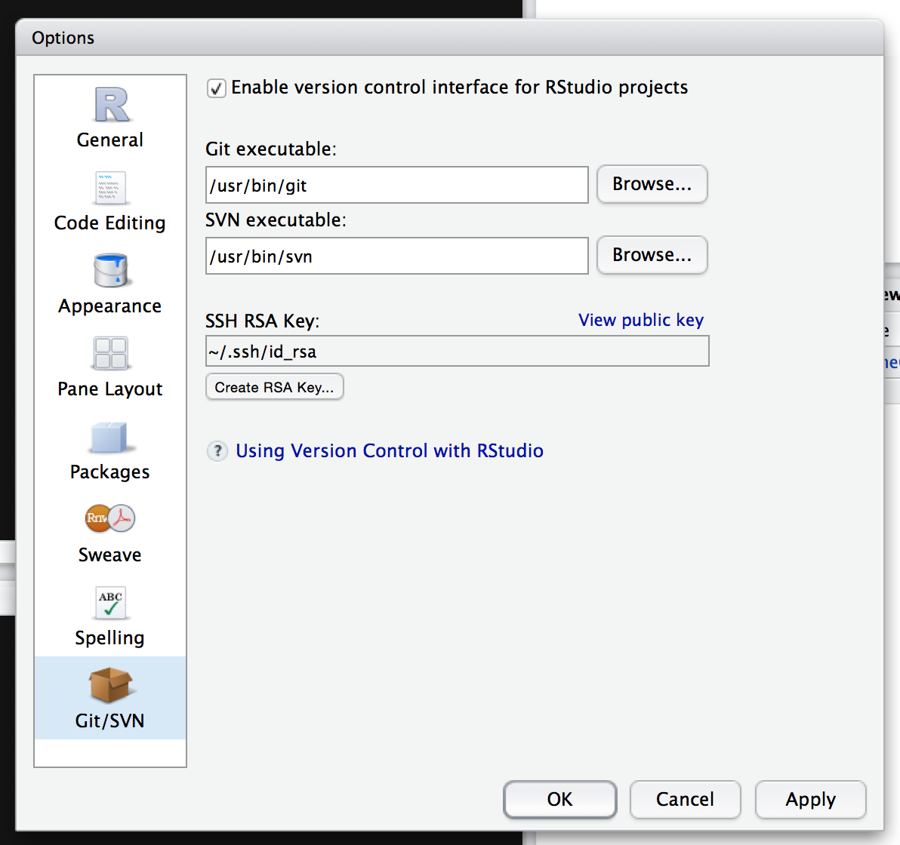

## Creating a Project with Git Integration

To start the tutorial, we'll go over the basics of checking in changes. To get started, we'll create an RStudio project. Create a project in RStudio in a new directory. Choose an empty project in the Project Type and make sure the *Create a git repository* option is checked.

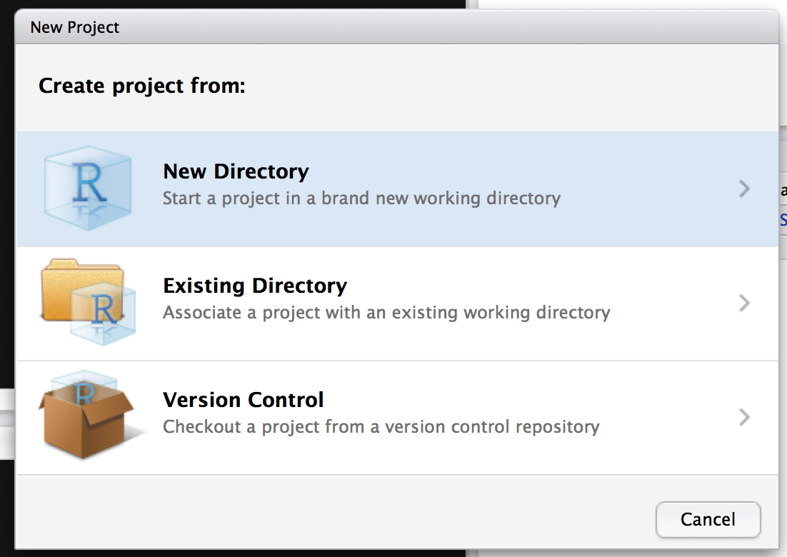
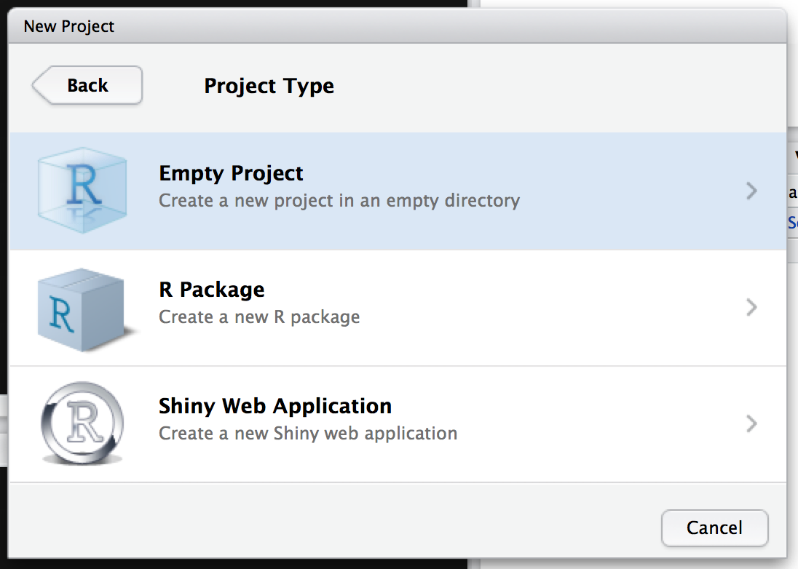
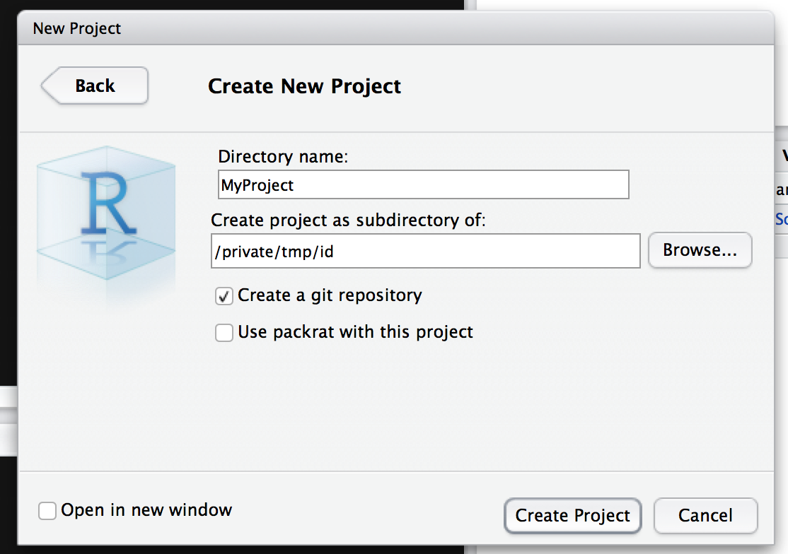

## Adding a New File to the Project

Create a new R Script from the *New File* menu and give it a name. Add some code to the file and save it.

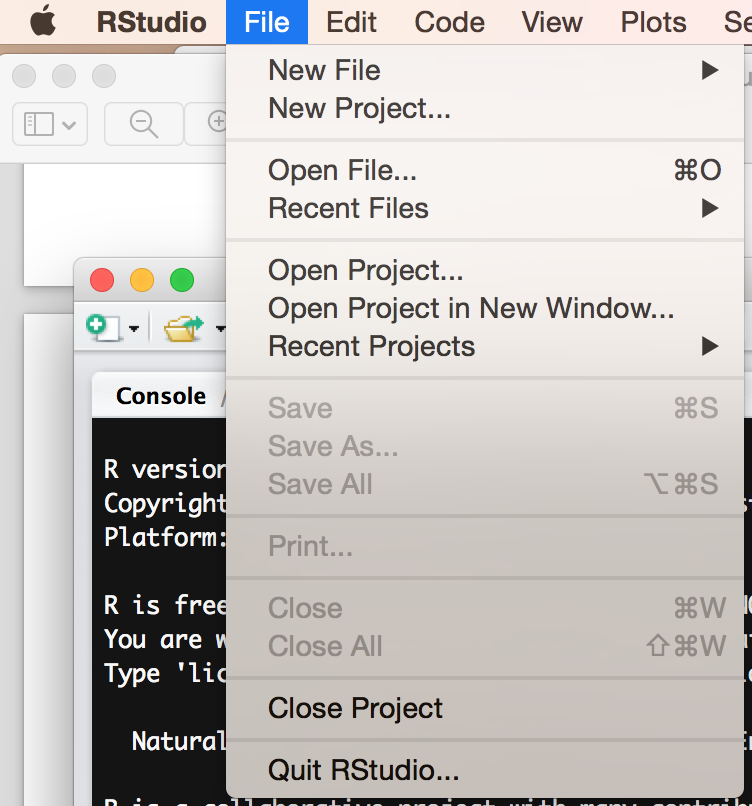
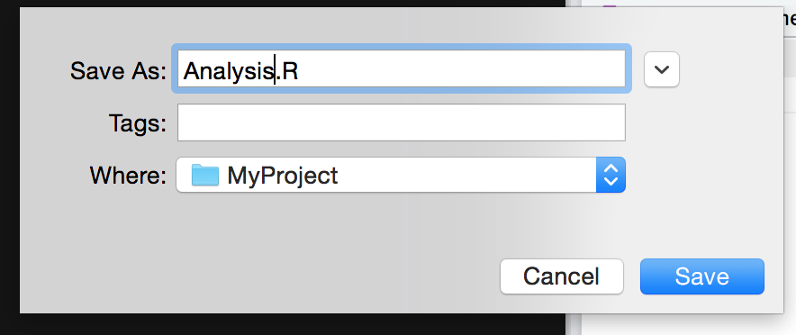

# Overview of the Git Panel

RStudio's Git integration consists of two components. The Git panel gives the overview of the files in your project. Clicking the *History* button (or the Diff or Commit buttons) brings up the detailed source control view.

## Empty Repositories

Git tracks the state of files by recording the changes. When you've made modifications to files, you can store those changes alongside a message. Git only tracks files that have been "added" to its own list of files it should track. When first started, Git won't track anything, so you'll have to add the files to git to track their changes.

This makes it easy to keep your repository cleaner: you only need to track the relevant files so temporary files or outputs won't "pollute" your commits.

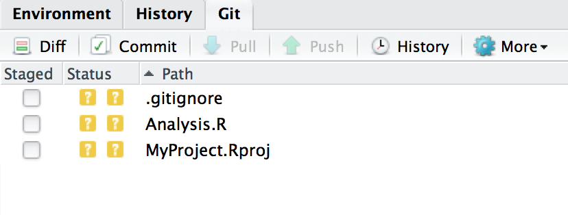

## Adding Files to Git

To set Git to record changes to files, add the file you created to it by checking the box next to its name in the Git panel. This "stages" the change (adding the file). A staged change isn't saved, but will be included when you commit. The file's status will change to an "A" to indicate that the file's addition will be included in your next commit.

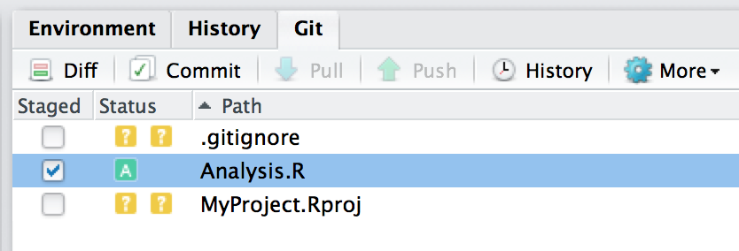

## Committing the Change

Click the commit button to show the commit editor. You can check the changes you're about to commit before giving your commit a message and clicking a commit button.

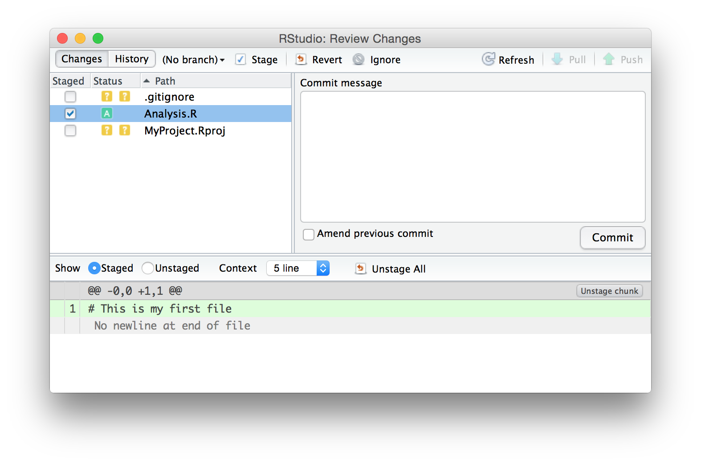

After committing your file, close the Git output window and the "Review changes" window to get back to the main RStudio interface.

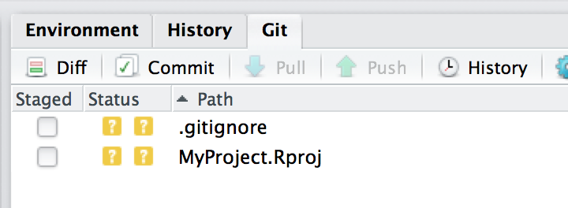

You'll see that your file isn't listed in the Git panel. This is because the file is now "clean"; it hasn't been changed since it was committed so there are no changes to stage.

Change the file and save it, and the Git panel will show that the file has been changed again.

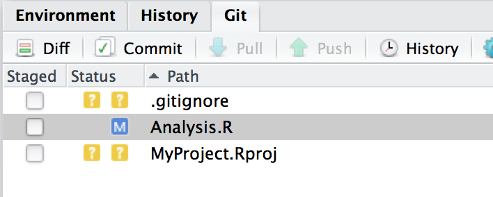

The file now shows up in the Git panel because it's been modified (M). You can stage these modifications by clicking the Staged checkbox.

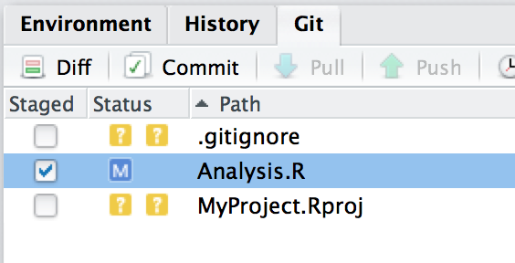

You can then commit the changes via the commit button again.

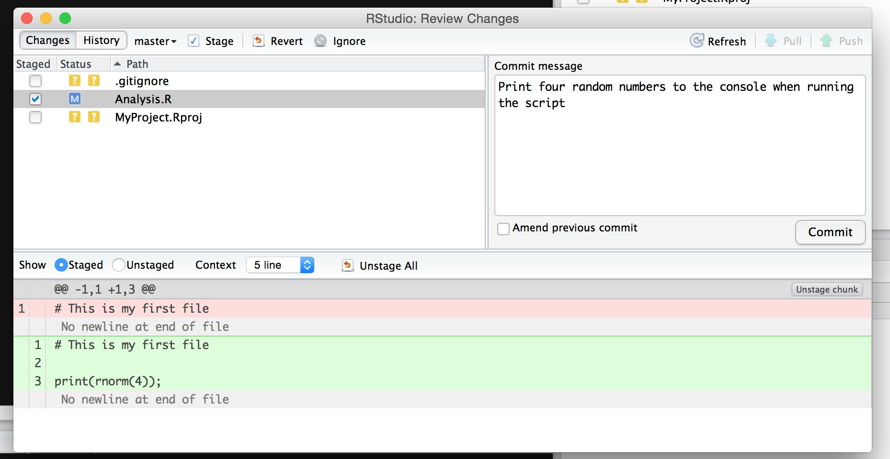

## Looking at Previous Revisions

The History button opens the Review Changes window that shows the history of commits made to the repository. 

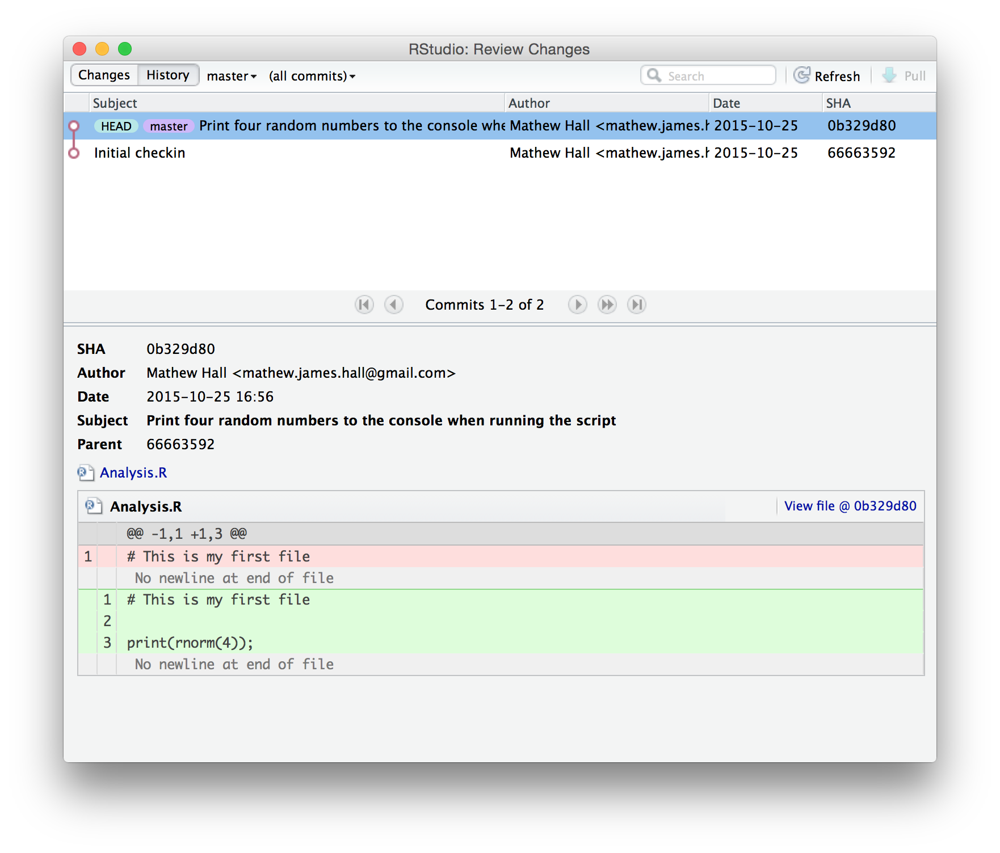

Selecting a commit will show the "diff" recorded by Git. You can also use the "View file @ (revision)" button to see how the file looked when it was committed. In RStudio, you can save this file elsewhere to retrieve old copies. *(Git provides more advanced features for dealing with (and changing) history but these aren't (currently) available from within RStudio.)*

### Diffs

When you make a commit, Git stores them as a bundle of diffs against the previous file. That way, Git always has a full set of all the changes made to the file since its addition to the repository. Diffs consist of several chunks; each chunk is a part of the file that changed. 

A chunk itself is made up of added and deleted lines. Sometimes, these are easy to read. Other times, they get confusing to read. For example, if you swap two large blocks of code they may be recorded as two separate chunks. You can keep your diffs readable by making your commits as self-contained as possible.

## Git for Single Users

We've covered the basics of working with Git for single users: you now have enough experience to use it in your own projects without having to email/duplicate old copies to keep working revisions. Instead, just note the revision (the "SHA" from the Review Changes history tab) used to generate results and you'll always be able to go back and regenerate them.

Git repositories can exist on shared services like Dropbox. However, if you do keep a repository in such a service, make sure you only modify it from one machine at a time, and that the repository is fully synchronised before you make any changes.

# Collaborating with Git

If you work with multiple collaborators (or use multiple computers), you can use Git to make sure everyone has a current copy of changes and to resolve problems when multiple people change the same files.

It's possible to copy a repository from one location to another, and all the changes will be kept. Because the history of the repository is included when the copy is taken, Git is able to work out how files should look if people make different changes to their own copies then try to merge them back into a central copy.

## Cloning a Repository

To start working with an existing repository, you can clone it. This takes a complete copy of the remote repository, allowing you to go back in its history as you can with other repositories. The clone operation also remembers where the repository came from. If the remote repository changes, you can then pull changes back into your own copy.

## GitHub and BitBucket

GitHub provides a free service that allows you to host a repository and share it with the public (private access is available for a fee). BitBucket provides a similar service. These services serve your central copy, which other collaborators can clone, make changes to, then push commits to.

## Cloning a GitHub Project

For this exercise, we've set up a GitHub repository at [https://github.com/SheffieldR/git-workshop](https://github.com/SheffieldR/git-workshop)
