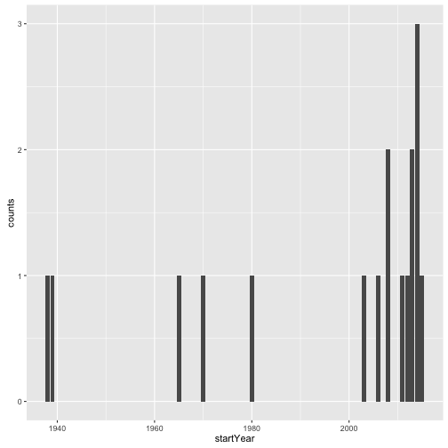

NBN Data Overview
========================================================
author: Mathew Hall
date: 23 Feb 2016
width: 1280
height: 1024

Accessing NBN Data from R in a Nutshell
========================================================

### There's a package for that!


```r
install.packages("rnbn")
library("rnbn")
```


### Sign up for a free NBN account


```r
NBN_USER <- 'my username'
NBN_PASSWORD <- 'super secret!'
```


### Login


```r
nbnLogin(NBN_USER,NBN_PASSWORD)
```

*You're good to go*!

Finding Species
========================================================

Species are identified by a Taxon Version Key, a unique name
for a (probably not) unique animal name. 

*Q: What's this?*


Ceci n'est pas un blaireau
========================================================


~~Badger~~ NHMSYS0000080191

Answer
========================================================


```r
badger_result <- getTVKQuery(query="badger", top=T)
badger_result
```

```
  entityType searchMatchTitle
1      taxon           Badger
                                                           descript
1 Meles meles (Linnaeus, 1758), TERRESTRIAL MAMMAL, 62725 record(s)
                                     pExtendedName  taxonVersionKey   name
1 Meles meles (Linnaeus, 1758), TERRESTRIAL MAMMAL NBNSYS0000164968 Badger
  languageKey taxonOutputGroupKey taxonOutputGroupName      organismKey
1          en    NHMSYS0000080085   terrestrial mammal NBNORG0000049711
     rank nameStatus versionForm gatewayRecordCount
1 Species    Synonym Well-formed              62725
                                           href ptaxonVersionKey
1 https://data.nbn.org.uk/Taxa/NHMSYS0000080191 NHMSYS0000080191
```

```r
badgerTVK <- badger_result$ptaxonVersionKey
```


What's the first recorded badger instance?
========================================================


```r
occ <- getOccurrences(badgerTVK)
```

```
Requesting batch 1 of 1 
Requesting data providers' information
```

```r
nrow(occ)
```

```
[1] 52253
```


```r
occ[1,c('datasetKey','startDate','endDate','latitude','longitude')]
```

```
  datasetKey  startDate    endDate latitude longitude
1   GA000720 2010-03-25 2010-03-25    53.56  -0.44573
```

Occurrence Information
========================================================
A data set might contain results from multiple surveys. The
survey is also tagged on the occurrence record too.


```r
names(occ)
```

```
 [1] "observationID"    "fullVersion"      "datasetKey"      
 [4] "surveyKey"        "sampleKey"        "observationKey"  
 [7] "siteKey"          "siteName"         "featureID"       
[10] "location"         "resolution"       "taxonVersionKey" 
[13] "pTaxonVersionKey" "pTaxonName"       "pTaxonAuthority" 
[16] "startDate"        "endDate"          "recorder"        
[19] "determiner"       "sensitive"        "absence"         
[22] "publicAttribute"  "dateTypekey"      "latitude"        
[25] "longitude"       
```

Where are they?
========================================================

The NBN data set contains observations of TVKs that are 
geotagged and datestamped. We know (roughly) where and
when the observation was recorded.


```r
occ[1:10,c('longitude','latitude')]
```

```
   longitude latitude
1   -0.44573   53.560
2   -1.71284   54.930
3   -1.71284   54.930
4   -5.85734   54.237
5   -2.71719   51.442
6   -3.71463   50.678
7   -4.09256   52.809
8    0.21964   51.859
9    0.21964   51.859
10  -1.22362   51.448
```

What's here?
========================================================
The NBN Gateway understands locations in two formats:

 - grid references (e.g. `SK3588`) 
 - Vice Counties (e.g. `63`)
 
The `getOccurrences` function can be used to search within
a location. For example: has a badger been spotted nearby?


```r
occurrences <-getOccurrences(tvks=badgerTVK, gridRef='SK38', silent=T)
nrow(occurrences)
```

```
[1] 18
```

Yes!

Where?
========================================================

```r
plot(occurrences$longitude, occurrences$latitude)
```

 

Make it fancy!
========================================================

```r
install.packages("ggmap")
library(ggplot2)
library(ggmap)
```


```r
location <- with(occurrences, c(mean(longitude),mean(latitude)))
map <- get_map(location, zoom=12, source="google")
occurrences$year = with(occurrences, substr(startDate,0,4))
ggmap(map) + 
    geom_point(data=occurrences,
              aes(x=longitude,y=latitude,colour=year)) #+
```

 

```r
    #geom_text(data=occurrences,aes(longitude,latitude,label=paste(startDate,endDate,sep='-')),angle=45,size=2,hjust=0,vjust=2)
```

What about Time?
========================================================

```r
library(dplyr)
```


```r
occurrences %>% 
  mutate(startYear = as.numeric(substr(startDate,0,4))) %>%
  group_by(startYear) %>%
  summarise(counts = n()) %>%
  ggplot() + geom_bar(aes(x=startYear,y=counts), stat="identity")
```

 

Getting an NBN Account
========================================================

### <https://data.nbn.org.uk/User/Register>


More Help
========================================================

### rnbn package vignette


```r
vignette('rnbn_vignette')
```

Preparing for the first hack event
========================================================

 - Get a GitHub account (<github.com>)
 - Register with the NBN (<https://data.nbn.org.uk/User/Register>)
 - Install RStudio
 - Get some ideas!
 
Acknowledgements 
========================================================

 - Data shown provided by various organisations via the NBN Gateway
 - Badger image is CC By Attribution Share Alike 3.0 Unported, copyright [BadgerHero](https://commons.wikimedia.org/wiki/File:Badger-badger.jpg)
